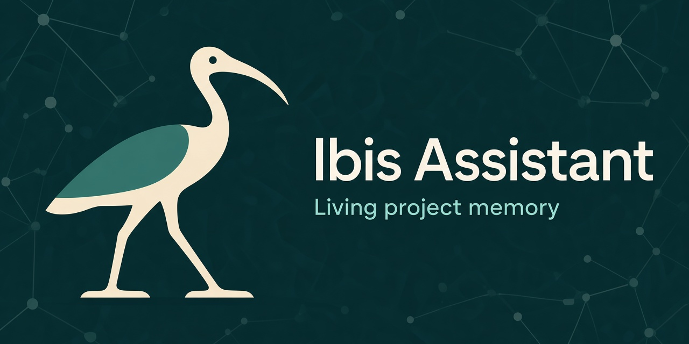

<!--
  GitHub profile README (terenzif/terenzif).
  Featured project: Ibis Assistant — living project memory over MCP.
-->

<p align="center">
  
</p>

<h1 align="center">F.Ter <code>@terenzif</code></h1>

<p align="center">
  Software that keeps agents grounded in real repos — history, structure, and intent.
</p>

---

## Featured: [Ibis Assistant](https://github.com/terenzif/ibis-assistant)

**Living project memory for AI agents** — one Go binary that turns Git history, code, and tickets into an MCP knowledge graph your IDE can query.

| | |
|:--|:--|
| **What it is** | Graph + RAG + timeline context server over [Model Context Protocol](https://modelcontextprotocol.io/) |
| **Why it exists** | Agents see the working tree; Ibis remembers *why* the code looks that way |
| **How you run it** | Download a release → `config fast` → connect Cursor / Claude / any MCP client |
| **Latest** | [**v0.1.0**](https://github.com/terenzif/ibis-assistant/releases/tag/v0.1.0) |

<p align="center">
  <a href="https://github.com/terenzif/ibis-assistant"></a>
  <a href="https://github.com/terenzif/ibis-assistant/releases/tag/v0.1.0"></a>
  <a href="https://github.com/terenzif/ibis-assistant/blob/master/LICENSE"></a>
</p>

### Highlights

- **Plug-and-play** — release binaries, wizard (`config fast` / `config full`), Settings UI at `/settings/`
- **Three runtimes** — personal, server, and Cursor **plugin** (stdio sidecar on the opened folder)
- **Hybrid AI** — local Ollama chat (hardware auto-tier, AMD/NVIDIA) + multi-cloud pool (Gemini, OpenAI-compatible, Claude)
- **Deep ingest** — Git graph, polyglot AST, log analysis with enrich + sidecar reports
- **Agent-ready MCP** — `ask_project`, `init_project`, ticketing/`repo_pr_*`, `settings_*`, guide at `ibis://guide`

### Start here

```text
1. https://github.com/terenzif/ibis-assistant/releases/tag/v0.1.0
2. Run ibis-assistant (first launch → config fast)
3. Connect MCP → Streamable HTTP /mcp  or  Cursor plugin (stdio)
```

<p align="center">
  <a href="https://github.com/terenzif/ibis-assistant"><strong>Repository</strong></a>
  ·
  <a href="https://github.com/terenzif/ibis-assistant/releases"><strong>Releases</strong></a>
  ·
  <a href="https://github.com/terenzif/ibis-assistant/blob/master/docs/ai_and_settings.md"><strong>AI &amp; Settings</strong></a>
  ·
  <a href="https://github.com/terenzif/ibis-assistant/blob/master/docs/runtime_modes.md"><strong>Runtime modes</strong></a>
</p>

---

<p align="center">
  
</p>

<p align="center">
  <sub>Primary open-source focus: <a href="https://github.com/terenzif/ibis-assistant">terenzif/ibis-assistant</a></sub>
</p>
