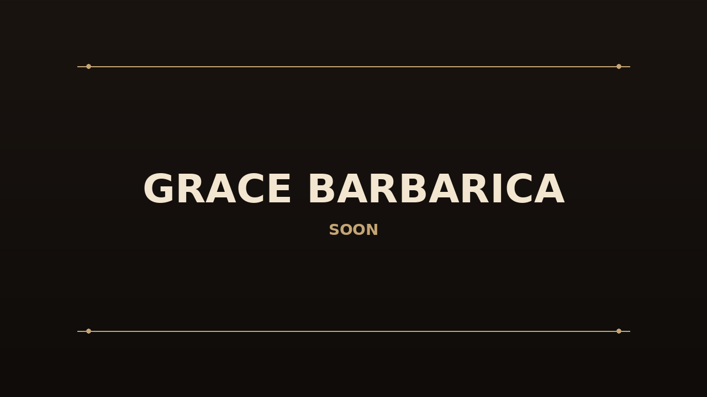
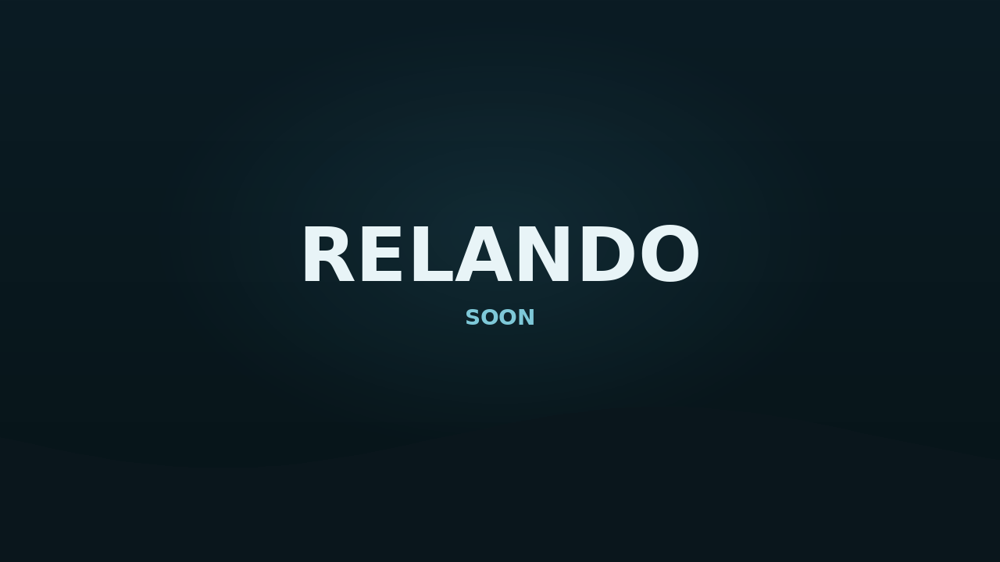

<!--
  GitHub profile README (terenzif/terenzif).
  Portfolio of four projects with 16:9 brand graphics.
-->

<h1 align="center">F.Ter <code>@terenzif</code></h1>

  Building focused tools — one public WIP, three more landing soon.

---

## Projects

<table>
  <tr>
    <td width="50%" valign="top">
      
       
      <h3><a href="https://github.com/terenzif/grindr-plus-plus">Grindr++</a></h3>
      
<em>take them all</em> — Xposed / LSPosed module for Grindr.

      
<strong>Public · WIP</strong>

    </td>
    <td width="50%" valign="top">
      
       
      <h3>Grace Barbarica</h3>
      
Soon to come.

      
<strong>Private · soon</strong>

    </td>
  </tr>
  <tr>
    <td width="50%" valign="top">
      
       
      <h3>Relando</h3>
      
Soon to come.

      
<strong>Private · soon</strong>

    </td>
    <td width="50%" valign="top">
      
       
      <h3>Ibis Assistant</h3>
      
Living project memory for AI agents — MCP knowledge over real repos.

      
<strong>Private · soon</strong>

    </td>
  </tr>
</table>

---

  Live now: <a href="https://github.com/terenzif/grindr-plus-plus">terenzif/grindr-plus-plus</a>

